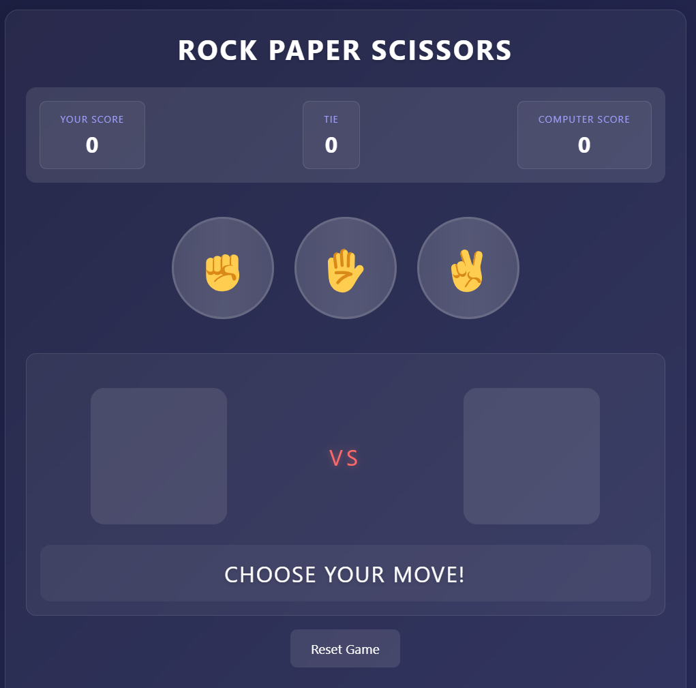

# 🎮 Rock Paper Scissors Game

A classic Rock Paper Scissors game built with HTML, CSS, and JavaScript where players can challenge the computer in an exciting best-of-five series!

## 📝 Table of Contents
- [Demo](#demo)
- [Features](#features)
- [Screenshots](#screenshots)
- [Technologies Used](#technologies-used)
- [Getting Started](#getting-started)
- [Game Rules](#game-rules)
- [Future Enhancements](#future-enhancements)
- [Contributing](#contributing)
- [Author](#author)

## 🎯 Demo
Try out the game here: [Live Demo](https://shahilmd.github.io/Rock-paper_scissor_project/)

## ✨ Features
- Interactive gameplay against computer AI
- Real-time score tracking
- Best-of-five game series format
- Responsive design for all devices
- Animated hand gestures
- Local storage to save game history
- Clean and modern user interface

## 📸 Screenshots



## 🛠️ Technologies Used
- HTML5
- CSS3
- JavaScript (ES6+)
- Git for version control
- GitHub Pages for hosting

## 🚀 Getting Started

### Prerequisites
- A modern web browser
- Basic understanding of HTML/CSS/JavaScript

### Installation
1. Clone the repository
   ```bash
   git clone https://github.com/your-username/rock-paper-scissors.git
   ```
2. Navigate to the project directory
   ```bash
   cd rock-paper-scissors
   ```
3. Open index.html in your browser
   ```bash
   open index.html
   ```

## 📜 Game Rules
1. Player selects one of three options: Rock, Paper, or Scissors
2. Computer randomly selects its move
3. Winner is determined by the following rules:
   - Rock crushes Scissors
   - Scissors cuts Paper
   - Paper covers Rock
4. First to win 3 rounds wins the game
5. Scores are tracked and displayed throughout the game

## 🔮 Future Enhancements
- [ ] Multiplayer mode
- [ ] Different difficulty levels for AI
- [ ] Additional weapons (Rock, Paper, Scissors, Lizard, Spock)
- [ ] User accounts and global leaderboard
- [ ] Customizable themes
- [ ] Achievement system

## 🤝 Contributing
1. Fork the repository
2. Create your feature branch
   ```bash
   git checkout -b feature/AmazingFeature
   ```
3. Commit your changes
   ```bash
   git commit -m 'Add some AmazingFeature'
   ```
4. Push to the branch
   ```bash
   git push origin feature/AmazingFeature
   ```
5. Open a Pull Request

## 👨‍💻 Author
Your Name
- GitHub: [@ShahilMd](https://github.com/ShahilMd)
- LinkedIn: [Your Name](www.linkedin.com/in/web-dev-md-shahil)


## 🙏 Acknowledgments
- Inspiration from classic arcade games
- Icons provided by [Font Awesome](https://fontawesome.com)
